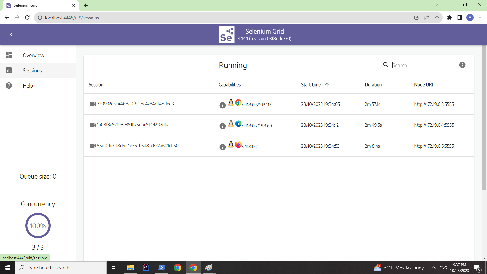
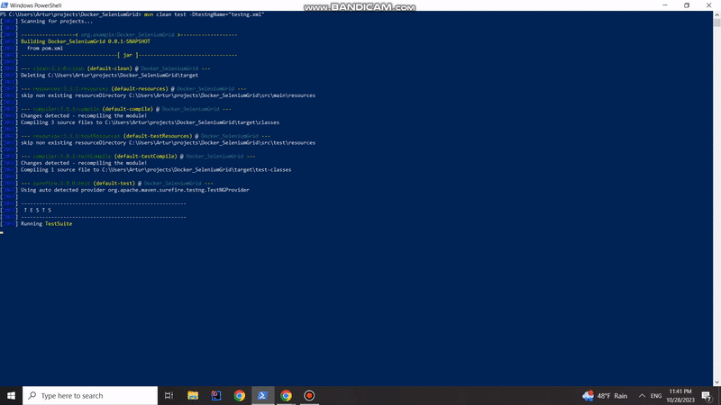
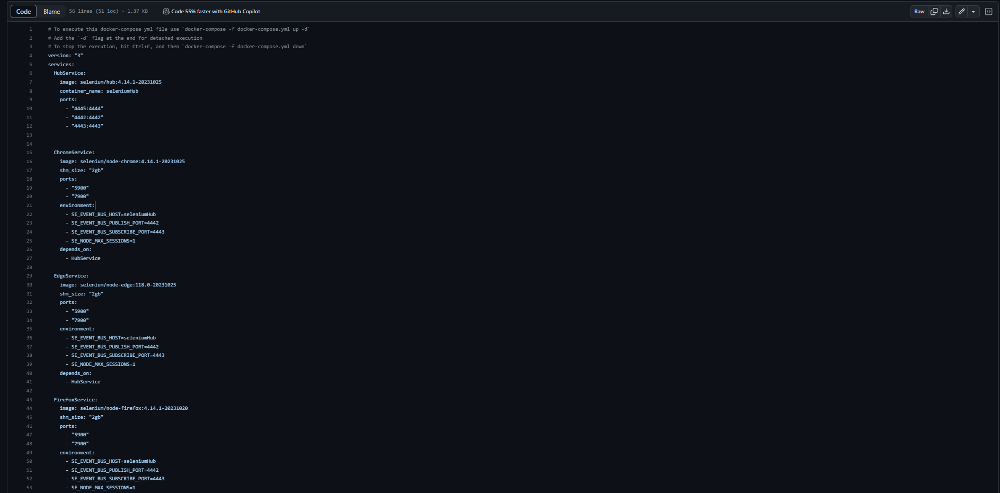

# Docker_SeleniumGrid
Parallel &amp; Cross-Browser testing project supported by Selenium Grid and Docker 	:whale:
<pre></pre>
## Content:
* [About](#about-project)
* [Technology Stack](#technology-stack)
* [Samples](#samples)
  + [Grid Network Overwiev](#grid-network-overview)
  + [Parallel Test Execution [GIF] ](#parallel-test-execution)
  + [Docker-compose configuration [LINK]](#docker-compose-configuration)

## About
<pre>
Project contain multi-container testing app.
Docker containers are build and configurate automatticly from docker-compose.yml file.
Each node container has diffrent browser on linux OS.
This configuration allows parallel testing across browsers, and is easy to customize for more complex environments.
  
Check out the samples with gifs and screenshots of the built environment.  
</pre>
* [Samples](#samples)

## Technology Stack
-  <b><i>Maven</b></i> -  software bulding tool
-  <b><i>JAVA</b></i> -  main Language
-  <b><i>Docker</b></i> -  separate environments implementation
-  <b><i>docker-compose</b></i> -  automatic Docker environments building and configuration
-  <b><i>WebDriver</b></i> -  Selenium web framework used to execute remote UI tests

## Samples

- ### Grid Network Overview
  
   
<pre></pre>
    

- ### Parallel Test Execution
   <b>[GIF]</b>

   

### Docker-compose configuration 
<i>[Docker File](https://github.com/anowacki10/Docker_SeleniumGrid/blob/master/docker-compose.yml)</i>

  
